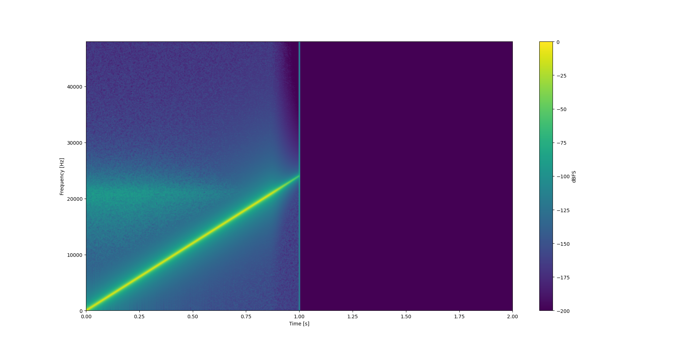
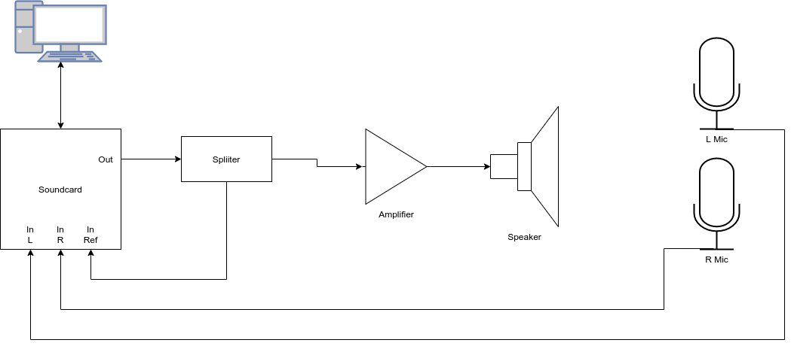
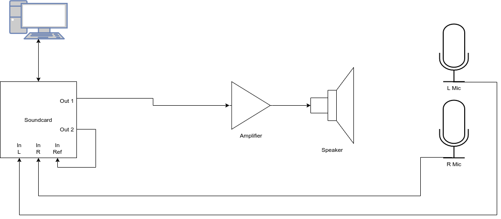

# room-raider
Tool for performing off-line impulse response capture of the room

Using The Software
======

## Help

Use the following command to see the software usage:

```bash
room-raider --help
```

The available option list will be the following:

```
  -d, --deconvolve       Deconvolve the captured signal
  -ef, --end-freq        End frequency of the sine sweep
  -g, --gain             Gain (in dB) of the sine sweep
  -h, --help             Output this help message
  -i, --in-file          Input audio file
  -n, --normalize        Set normalization mode
  -ng, --norm-gain       Set normalization peak gain (in dB)
  -o, --out-file         Output audio file
  -r, --reference        Reference audio file
  -s, --sweep            Produce sine sweep signal
  -sf, --start-freq      Start frequency of the sine sweep
  -sl, --sweep-length    The length of the sweep in ms
  -sr, --srate           Sample rate of output files
```

## Performing Measurements

This software is designed to generate test signals for the excitation of rooms and postprocess recordings performed with said test signal in order to extract the impulse response(s). The measurement process is comprised of three steps:

* Test signal generation;
* Data capture; and
* Captured data postprocessing.

The steps are discussed in details below.

### Test Signal Generation

The test signal is a linear swept sine. The user can specify its starting and ending frequencies, gain and duration. An example is shown below:

```bash
room-raider -s -sr 96000 -sf 0 -ef 24000 -g -6 -sl 1000 -o testsig.wav
```

Note that the gain is specified in `dB` (`-g -6`) and the swept sine is specified in milliseconds (`-sl 1000`). For more information, see `room-raider --help`.

For best results, the sweep should slightly exceed the audible range. A sweep between 0 Hz and 24 kHz is expected to perform well in most conditions.

The duration of the swept sine should be longer than the expected reverberation time of the room under test. Note that the swept sine will be followed by a zero pad as long as the swept sine itself. This zero pad in integral part of the test signal and has the purpose of allowing the recording of the entire reverberant tail of the room (see next sections).

The spectrogram of the test signal produced by the command above is shown below.



### Data Capture

To measure a room the room needs to be exited. We refer to any system by which the room is excited as _speaker system_. This can be any combination of amplifiers and speakers. For best results, the response of the speaker system should be flat.

The test signal has the be reproduced at the room input (a speaker system) while simultaneously recording a number of signals. The following signals need to be all simultaneously recorded.

* Room outputs. Typically, this is the signal collected by two microphones placed at a point of interest in the room. These signals need to be provided in the same multichannel track.
* Reference signal. This signal should capture the input provided to the speaker system. This signal should be provided as a single mono record. There are few different options to practically collect the reference signal.

The recordings of the signals listed above should *not be shorter* of the entire duration of the test signal, including zero padding.

#### Reference Signal Option 1: Split Feed



The picture above shows the connection diagram for the option 1 for room outputs and reference signal simultaneous capture. The test signal is streamed to one of the ouput channels of the soundcard. From there, the signal is split and delivered both to the speaker system (in this example and amplifier and speaker) and to the channel of the soundcard assigned to capture the reference. The room outputs are capture by two other soundcard channels.

The device used to split the signal should be able to do so without introducing unwanted loading effects on the rest of equipment. A mixer or DI box are examples of devices that are expected to be fit for purpose.

#### Reference Signal Option 2: Loopback



The picture above shows the connection diagram for the option 2 for room outputs and reference signal simultaneous capture. In this case, the test signal is streamed simultaneously to two outputs of the soundcard. However, one of the outputs is looped back into the reference channels.

This option is equivalent to option 1 when the soundcard channels all have matched response and latency, which is very often the case for modern soundcards. If this is not the case, latency might be wrongly compensated in the final result. However, errors of more than a few samples are not expected for modern soundcards.

#### Discussion and Alternative Option

For best results with either of the options above, one should pay close attention to the following:

* Soundcard input and output gains: these controls, if available, should be set to prevent any clipping or unwanted distortion in the entire chain. Distortion will corrupt the measurement.
* Speaker system gain: this gain should be set to ensure good test signal level above background noise, but care must be taken in order to prevent distortion in the chain. Distortion will corrupt the measurement.
* Possible feedback loops in the DAW used to capture the various signals, for example DAW connections between the track used to record the test microphones outputs and the soundcard outputs. Feedback loops within the DAW should be eliminated. In particular, the tracks used for recording of the test microphones are *not* to be routed to the soundcard outputs.

In case spare channels are not available for the recording of the reference signal, the reference recording can be omitted. In postprocessing, the very same test signal used for the measurement can be used as a reference. However, in this case, the postprocessor will be unable to remove the soundcard latency, that will be then embedded in the resulting impulse response.

### Postprocessing

After the data acquisition step is completed, the following files will be available:

* Room outputs file. This is a multichannel track containing the audio recorded by the test microphones.
* Reference file. This is a mono track containing the audio recorded by the soundcard reference channel as discussed in the previous section.

The postprocessor uses the audio files listed above to compute the impulse responses. An example is shown below:

```bash
room-raider -d -sr 96000 -i room-outputs.wav -r reference.wav -o response.wav
```

For more information, see `room-raider --help`.

The file `response.wav` will have the same number of channels as `room-outputs.wav` and will contain the electroacoustic impulse responses from soundcard output to each of the test microphones.

Additionally, the output sample can be normalized with options ```-n``` and ```-ng```. While ```-ng``` option sets the maximum peak level (in dB) of the output sample, 
the ```-n``` option allows to specify the normalization algorithm:
  * **none** - do not use normalization (default);
  * **above** - normalize the file if the maximum signal peak is above the specified peak level;
  * **below** - normalize the file if the maximum signal peak is below the specified peak level;
  * **always** - always normalize output files to match the maximum signal peak to specified peak level.

Requirements
======

The following packages need to be installed for building:

* gcc >= 4.9
* GNU make >= 4.0
* libsndfile
* libiconv

Building
======

To build the tool, perform the following commands:

```bash
make config # Configure the build
make fetch # Fetch dependencies from Git repository
make
sudo make install
```

To get more build options, run:

```bash
make help
```

To uninstall library, simply issue:

```bash
make uninstall
```

To clean all binary files, run:

```bash
make clean
```

To clean the whole project tree including configuration files, run:

```bash
make prune
```

To fetch all possible dependencies and make the source code tree portable between
different architectures and platforms, run:

```bash
make tree
```

To build source code archive with all possible dependencies, run:

```bash
make distsrc
```